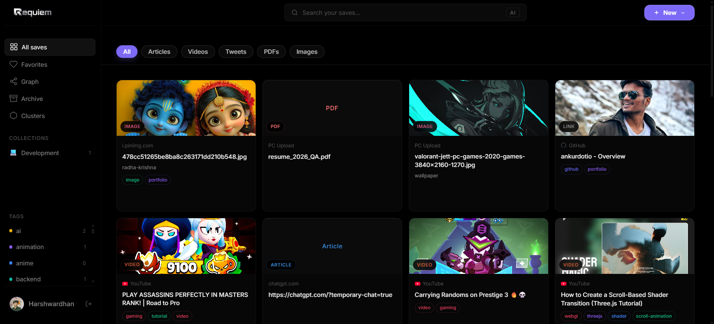
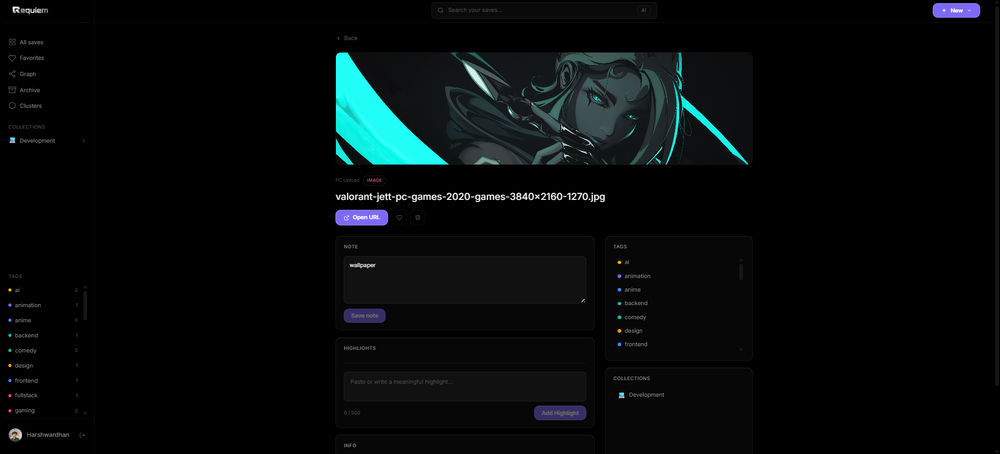
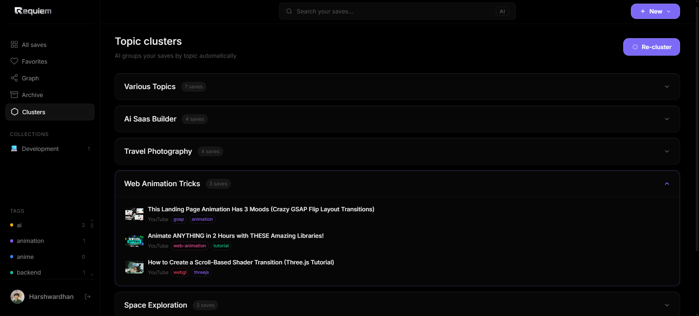
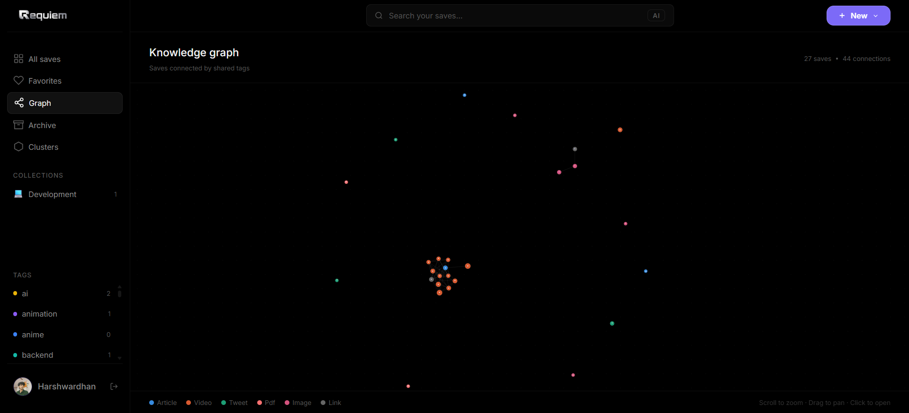

# Requiem 🖤
> **The Digital Graveyard for Your Saves, Resurrected.**

Requiem is a premium Personal Knowledge Management (PKM) system designed to organize, connect, and resurface your web discoveries. Built for developers, researchers, and digital hoarders who want to turn their "Save for later" lists into a functional second brain.

---

## 📸 Screenshots





---

## 🧠 About the Project

### The Problem
We save hundreds of links, articles, and videos every month across different platforms. Most of them end up in a "Digital Graveyard"—forgotten, unorganized, and impossible to find when actually needed. "Save for later" usually means "never look at it again."

### The Solution: Requiem
Requiem solves the "Search vs. Discovery" problem. It doesn't just store links; it **understands** them. Using Mistral AI, it automatically tags your content, generates embeddings for semantic search, and uses a "Resurface" logic to bring old, relevant knowledge back to your attention.

---

## ✨ Features

*   🌐 **Intelligent URL Scraping**: Paste a link and watch Requiem instantly fetch titles, descriptions, high-res thumbnails, and site icons.
*   📁 **Universal File Storage**: Upload images, videos, and PDFs directly to the cloud via integrated Supabase Object Storage.
*   🤖 **Mistral AI Auto-Tagging**: Intelligent categorization that creates a self-organizing knowledge base without manual effort.
*   🔍 **Semantic Search**: Go beyond keywords. Search for "how to scale databases" and find relevant saves even if those exact words aren't in the title.
*   📝 **Premium Note Taking**: Capture thoughts with smart highlights, featuring auto-resizing inputs and character limits to keep insights concise.
*   🌊 **Fluid UX**: Experience silky-smooth interactions powered by Lenis Smooth Scroll and Framer Motion micro-animations.
*   🏷️ **Dynamic Collections**: Group saves into logical buckets with custom emojis and cinematic color palettes.

---

## 🛠️ Tech Stack

**Frontend:**
*   **Framework:** React 19 + Vite (Next-gen performance)
*   **State Management:** TanStack Query v5 (Server state) & Zustand (UI state)
*   **Styling:** SCSS Modules with a centralized Design System (Mixins/Variables)
*   **Motion:** Framer Motion & Lenis Scroll for premium feel

**Backend:**
*   **Environment:** Node.js (ES Modules)
*   **Framework:** Express.js v5 (Alpha features for better error handling)
*   **Database:** MongoDB with Mongoose (Optimized compound indexing)
*   **Async Processing:** Redis + BullMQ for background AI tasks
*   **Storage:** Supabase Object Storage (Centralized asset management)
*   **AI Engine:** Mistral AI (`mistral-small-latest` & Embedding models)

---

## ⚙️ Installation & Setup

### 1. Clone the repository
```bash
git clone https://github.com/yourusername/requiem.git
cd requiem
```

### 2. Install Dependencies
```bash
# Install backend deps
cd backend && npm install

# Install frontend deps
cd ../frontend && npm install
```

### 3. Environment Variables
Create a `.env` file in both `backend` and `frontend` directories.

**Backend (`backend/.env`):**
```env
PORT=8000
MONGODB_URI=your_mongodb_connection_string
ACCESS_TOKEN_SECRET=your_secret
REFRESH_TOKEN_SECRET=your_refresh_secret
MISTRAL_API_KEY=your_mistral_key
VITE_SUPABASE_URL=your_supabase_url
VITE_SUPABASE_SERVICE_ROLE_KEY=your_service_role_key
REDIS_URL=your_redis_url
```

**Frontend (`frontend/.env`):**
```env
VITE_API_BASE_URL=http://localhost:8000/api/v1
```

### 4. Run the App
```bash
# Start Backend (from /backend)
npm run dev

# Start Frontend (from /frontend)
npm run dev
```

---

## 📂 Folder Structure
```text

requiem/
├── backend/
│   └── src/
├── frontend/
│   └── src/
├── extension/        
├── screenshots/
```

---

## 🚀 API Architecture
Requiem follows a **RESTful API** pattern with standard `ApiResponse` and `ApiError` wrappers.
*   `POST /api/v1/saves` - Initiates save + background AI processing.
*   `GET /api/v1/saves?semantic=true` - Triggers AI-powered vector search.
*   `POST /api/v1/upload` - Directly handles asset streaming to Supabase.

---

> Built with 🖤 by [Harshwardhan Singh Solanki]
> *A requiem for forgotten saves, resurrecting them back to life.*
